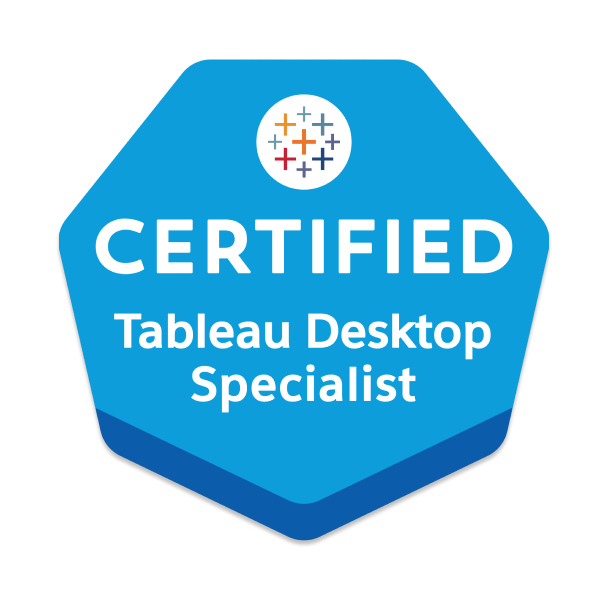

## Hi there 👋 I'm Yuting Zeng 
- I’m a **Data Analyst** and **BI Developer** passionate about uncovering trends and delivering actionable insights from complex datasets. With expertise in **data analysis**, **data visualization**, and **business intelligence solutions**, I specialize in analyzing data, creating interactive dashboards, and leveraging advanced tools to support data-driven decision-making.
---

## 🔧 What I’m Good At  
- **SQL&TSQL**: Proficient in writing complex queries for data extraction, transformation, and analysis. Experienced with CTEs, Joins, window functions, and optimizing performance using indexing and stored procedures
- **Python**: Skilled in cleaning, analyzing, and visualizing data using libraries like Pandas, NumPy, Matplotlib, and Seaborn. Experienced in automating workflows, conducting time-series analysis, and developing unit tests to ensure data quality. 
- **Data Analysis & Visualization**: Power BI (DAX), Tableau, Tableau Prep, Python (Pandas, Seaborn, Matplotlib), Excel (Pivot, VLOOKUP)
- **Database & ETL Tools**: Hands-on experience with Azure Data Factory, Databricks, AWS (S3, Lambda, API, Athena), Airflow, SQL Server, MySQL, and MongoDB for ETL pipeline development and database management.
- **Data Modeling**: Star Schema, Machine Learning (Time-Series, XGBoost)
- **Testing**: Proficient in unit testing, data validation, and A/B testing to ensure accuracy and reliability of data pipelines and dashboards.

---

## 📊 Skills Breakdown

### **Core Technical Skills**

| **Category**                 | **Tools/Technologies**                                                                 |
|------------------------------|----------------------------------------------------------------------------------------|
| **Programming**              | SQL (&T-SQL), Python (Pandas, NumPy, Matplotlib, Seaborn), Java, HTML                  |
| **Data Visualization**       | Tableau, Tableau Prep, Power BI (DAX), Excel (Pivot Tables, VLOOKUP), SAP Analytics Cloud|
| **Databases**                | Snowflake, PostgreSQL, SQL Server, MySQL, Azure SQL Database, MongoDB                 |
| **Statistical Analysis**     | A/B Testing, Time-Series Analysis, Predictive Modeling (XGBoost), Exploratory Data Analysis|
| **Data Tools & ETL**         | Azure Data Factory, Databricks, AWS (S3, Lambda, Glue, API, Athena), Alteryx          |
| **Platforms & Environments** | VSCode, Jupyter, Git, AWS CloudWatch/SNS, Azure CLI, Power Apps                       |

--- 

### **Soft Skills**  
- **Communication**: Effective communication skills to translate complex data into actionable insights for non-technical stakeholders.
- **Collaboration**: Strong collaboration skills, with experience in working with cross-functional and Agile teams.
- **Problem Solving**: Detail-oriented problem-solving with a focus on accuracy, efficiency, and continuous improvement.
- **Adaptability**: Ability to adapt to dynamic environments, ensuring successful project delivery under tight deadlines.
- **Process Improvement**: Proactive in identifying process inefficiencies and implementing data-driven solutions for operational optimization.

---

## 🎓 Education
- University of Wisconsin-Madison | M.S. in Information Science

---
## 📬 Let’s Stay Connected  
📧 **Email**: [im.zengyt02@gmail.com](mailto:im.zengyt02@gmail.com)  
🌐 **LinkedIn**: [linkedin.com/in/yuting-kay-zeng]([https://www.linkedin.com/in/yuting-kay-zeng/])  

---
